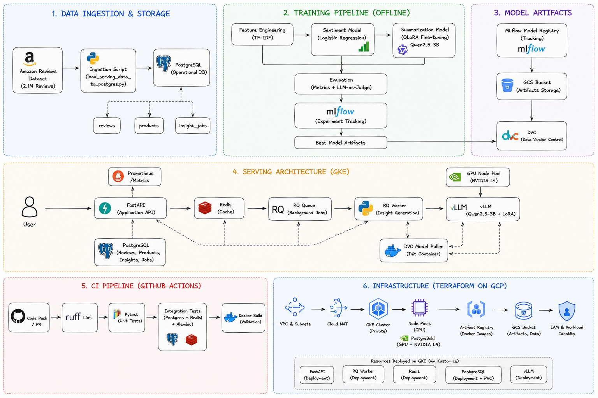

# Ecommerce Review Intelligence Platform

This project turns raw ecommerce reviews into product-level sentiment insights and short review summaries.

It combines a lightweight sentiment model (**TF-IDF + Logistic Regression**) with a fine-tuned LLM (**Qwen2.5-3B-Instruct + QLoRA**) and serves the results through an async application stack built with **FastAPI, Redis Queue, PostgreSQL, and vLLM on GKE**.

## Architecture




## Demo

[](https://www.youtube.com/watch?v=2t5lR_kI96U)

[Watch the demo on YouTube](https://www.youtube.com/watch?v=2t5lR_kI96U)

## What this project includes

- end-to-end data + ML pipeline using **DVC**
- sentiment classification with **TF-IDF + Logistic Regression**
- representative review selection with **Sentence Transformers**
- synthetic summary generation for SFT data
- summarization fine-tuning with **Qwen2.5-3B-Instruct + QLoRA**
- experiment tracking with **MLflow**
- async serving with **FastAPI + Redis + RQ + PostgreSQL**
- GPU inference with **vLLM on NVIDIA L4 (GKE)**
- infrastructure managed with **Terraform + Kustomize**
- **GitHub Actions CI** for linting, testing, and Docker build validation

## Tech Stack

### ML / NLP
- Python
- scikit-learn
- PyTorch
- Hugging Face Transformers
- TRL
- PEFT
- Sentence Transformers
- Qwen2.5-3B-Instruct
- QLoRA / LoRA

### Backend / Serving
- FastAPI
- Uvicorn
- PostgreSQL
- SQLAlchemy
- Alembic
- Redis
- RQ
- vLLM

### MLOps / Infra
- DVC
- MLflow
- Docker
- Docker Compose
- Kubernetes / GKE
- Kustomize
- Terraform
- Artifact Registry
- Google Cloud Storage
- Workload Identity

### Engineering
- GitHub Actions
- pytest
- Ruff

## Repository Structure

```bash
.
├── alembic/
├── artifacts/
├── configs/
├── data/
├── docs/
├── infra/
│   ├── compose/
│   ├── docker/
│   ├── k8s/
│   └── terraform/
├── scripts/
├── src/
├── tests/
├── .github/workflows/
├── Dockerfile
├── dvc.yaml
├── dvc.lock
├── params.yaml
├── pyproject.toml
└── requirements*.txt
```

## Docs

Detailed docs:

- [01_project_overview.md](docs/01_project_overview.md)
- [02_system_architecture.md](docs/02_system_architecture.md)
- [03_data_ml_pipeline.md](docs/03_data_ml_pipeline.md)
- [04_preprocessing.md](docs/04_preprocessing.md)
- [05_installation.md](docs/05_installation.md)
- [06_configuration.md](docs/06_configuration.md)
- [07_running_the_application.md](docs/07_running_the_application.md)
- [08_evaluation_benchmarking.md](docs/08_evaluation_benchmarking.md)
- [09_gke_deployment.md](docs/09_gke_deployment.md)

## Quick Start

### Local
If you want to run the app locally, start here:

1. [Installation guide](docs/05_installation.md)
2. [Configuration guide](docs/06_configuration.md)
3. [Run the application](docs/07_running_the_application.md)

### Cloud / GKE
If you want to run the GKE version:

1. provision infrastructure with Terraform
2. build and push images
3. deploy manifests with Kustomize
4. deploy the GPU serving stack

Full steps are here:

- [09_gke_deployment.md](docs/09_gke_deployment.md)

## Notes

- PostgreSQL and Redis are deployed inside the GKE dev environment for this project.
- Large model artifacts are tracked with **DVC** and stored in **GCS**.
- Small sentiment artifacts are packaged with the application image.

