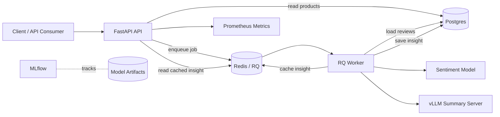

# System Architecture

---

## Components

```text
Client
  ↓
FastAPI API
  ↓
Postgres / Redis / RQ Worker
  ↓
Sentiment model + vLLM summarization model
```

- **FastAPI API**
  - Exposes REST endpoints for product search, product details, insight generation, job polling, saved insights, and metrics.

- **PostgreSQL**
  - Stores product metadata, customer reviews, and generated insight results.

- **Redis**
  - Serves as both the RQ message broker and cache for generated insights.

- **RQ Worker**
  - Executes insight generation tasks asynchronously outside the request-response lifecycle.

- **Sentiment Model**
  - Classifies reviews into positive, neutral, and negative sentiments before summarization.

- **vLLM**
  - Provides an OpenAI-compatible API for LLM inference.

- **MLflow**
  - Tracks experiments, metrics, and model artifacts during development.

---

## Runtime architecture



---

## Insight generation flow

The insight endpoint is asynchronous because LLM summarization can be slow.

```text
1. Client sends POST /products/{product_id}/insights/jobs
2. API creates an RQ job and returns a job_id
3. Worker loads product reviews from Postgres
4. Worker classifies reviews by sentiment if sentiment label is not provided
5. Worker selects representative reviews from each sentiment group
6. Worker sends selected reviews to the vLLM summary endpoint
7. Worker saves the generated insight to Postgres
8. Worker caches the insight in Redis
   GET /products/{product_id}/insights
```

## Storage Model


| Data | Storage |
|---|---|
| Product metadata, Reviews, Generated Insights | Postgres |
| Insight cache | Redis |
| Job queue and job status | Redis / RQ |
| Model artifacts and reports | `artifacts/`, models are tracked with MLflow |

## Main API Paths

```text
GET  /health
GET  /products
GET  /products/{product_id}
POST /products/{product_id}/insights/jobs
GET  /jobs/{job_id}
GET  /products/{product_id}/insights
GET  /metrics
```
