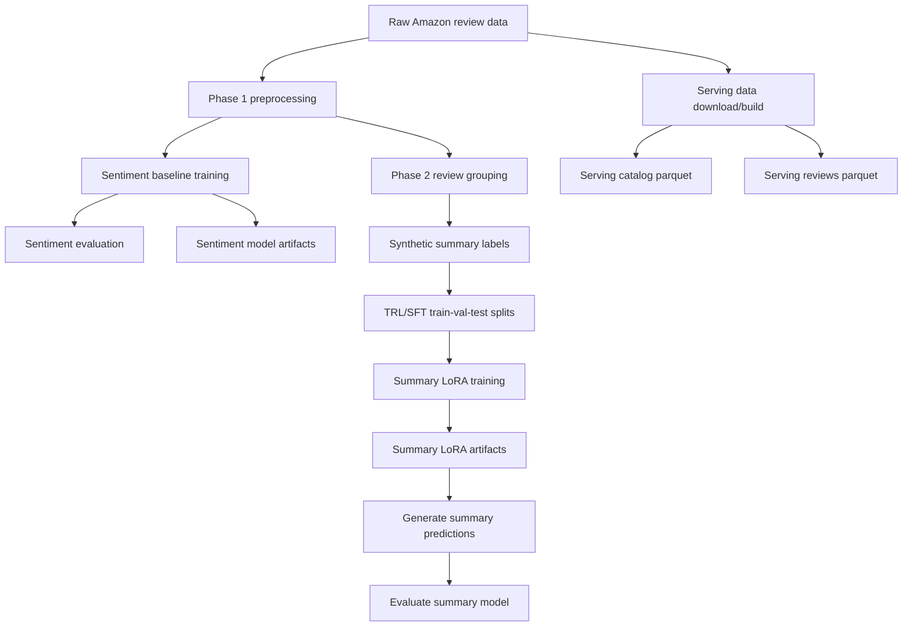
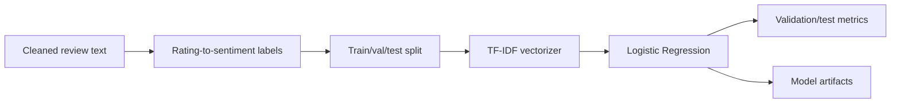
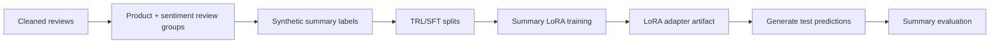

# Data and ML Pipeline

## Pipeline overview



## DVC stages

The pipeline is defined in `dvc.yaml` and configured through `params.yaml`.

| DVC stage | Main code | Purpose | Main outputs |
|---|---|---|---|
| `download_raw_sample` | `scripts/download_data.py` | Download/sample raw review and metadata files for the ML pipeline. | raw review/meta files under `data/raw/` |
| `preprocess_phase1` | `src/data/preprocess_phase1.py` | Clean reviews, filter data, map ratings to sentiment labels, and create train/val/test splits. | cleaned reviews, train/val/test files |
| `train_sentiment_baseline` | `src/training/train_sentiment_baseline.py` | Train the TF-IDF + Logistic Regression sentiment baseline. | sentiment model, vectorizer, validation metrics |
| `evaluate_sentiment_baseline` | `src/evaluation/evaluate_sentiment_baseline_model.py` | Evaluate the sentiment model on the held-out test set. | test metrics, predictions, classification report, confusion matrix |
| `download_serving_data` | `scripts/download_data.py` | Download the larger serving dataset used by the API. | raw serving reviews/meta files |
| `build_serving_catalog` | `src/serving/build_catalog.py` | Build product-level serving data. | `data/serving/appliances_demo_catalog.parquet` |
| `build_serving_reviews` | `src/serving/build_reviews_index.py` | Build review-level serving data. | `data/serving/appliances_demo_reviews.parquet` |
| `preprocess_phase2_review_groups` | `src/data/preprocess_phase2.py` | Group reviews by product and sentiment, then select representative reviews. | grouped review JSONL/CSV |
| `generate_synthetic_gold_summary` | `scripts/generate_synthetic_gold_summary_via_api.py` | Generate synthetic summary labels for grouped reviews. | synthetic summary JSONL and error log |
| `build_trl_sft_splits` | `src/data/preprocess_phase2_sft_trl.py` | Convert synthetic summaries into TRL/SFT train/val/test splits. | SFT train/val/test JSONL files |
| `train_summary_sft` | `src/training/train_sft.py` | Train the summary LoRA adapter. | `artifacts/models/summary_sft/` and training reports |
| `generate_summary_predictions` | `scripts/summary_model_generation_testset.py` | Run the trained summary adapter on the test set. | summary predictions and generation metrics |
| `evaluate_summary_model` | `src/evaluation/evaluate_summary_model.py` | Evaluate generated summaries against reference summaries. | summary evaluation report and per-sample results |
| `register_summary_lora_to_mlflow` | `scripts/register_summary_lora_to_mlflow.py` | Register the trained summary LoRA and metadata in MLflow. | MLflow run/model metadata |

## Recommended run order

For the offline ML pipeline, running these commands to reproduce:

```bash
# 1. Build and evaluate the sentiment baseline
make sentiment-e2e

# 2. Build serving-ready product/review parquet files
make repro-serving

# 3. Build grouped review data and synthetic summary labels
make summary-data-e2e

# 4. Train the summary LoRA adapter
make train-summary-sft

# 5. Generate predictions from the trained summary model
make summary-predict

# 6. Evaluate summary quality
make summary-eval
```


## Sentiment pipeline

The sentiment pipeline is assigned to classify sentiment of a review if the review is not provided with sentiment label.



The baseline uses review text as input and predicts one of three sentiment labels: positive, neutral, or negative. These labels are later used to route reviews into sentiment-specific groups before summarization.

Main files:

```text
src/data/preprocess_phase1.py
src/training/train_sentiment_baseline.py
src/evaluation/evaluate_sentiment_baseline_model.py
```

Main artifacts:

```text
artifacts/models/sentiment_baseline/
artifacts/reports/sentiment_baseline/
```


## Serving table pipeline

The serving pipeline creates product and review parquet files( full dataset ) that can be loaded into Postgres.

Main files:

```text
src/serving/build_catalog.py
src/serving/build_reviews_index.py
scripts/load_serving_data_to_postgres.py
```

Expected outputs:

```text
data/serving/appliances_demo_catalog.parquet
data/serving/appliances_demo_reviews.parquet
```

These files are used by the backend service after they are loaded into Postgres. The database loading step is part of local serving setup, not model training.


## Summary pipeline

The summary pipeline prepares grouped review examples and trains a LoRA adapter for review-theme summarization.



Main files:

```text
src/data/preprocess_phase2.py
scripts/generate_synthetic_gold_summary_via_api.py
src/data/preprocess_phase2_sft_trl.py
src/training/train_sft.py
scripts/summary_model_generation_testset.py
src/evaluation/evaluate_summary_model.py
```

Main artifacts:

```text
artifacts/models/summary_sft/
artifacts/reports/summary_sft/
artifacts/predictions/
```